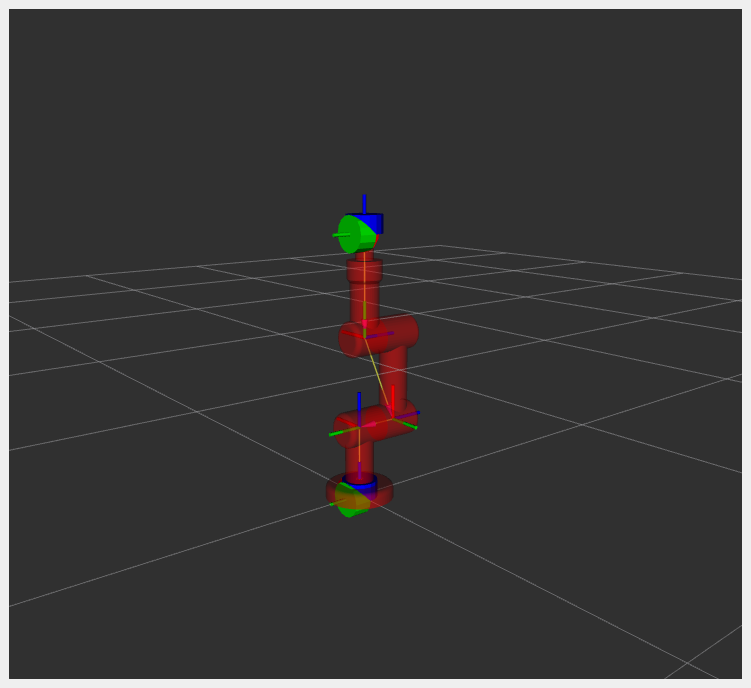
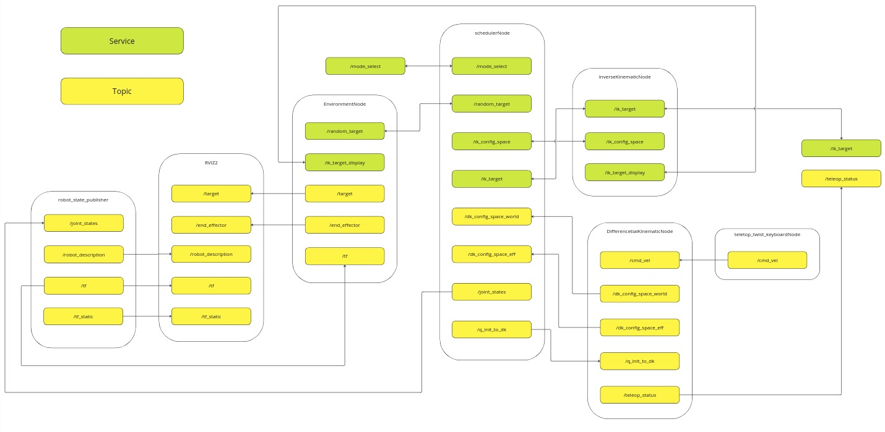
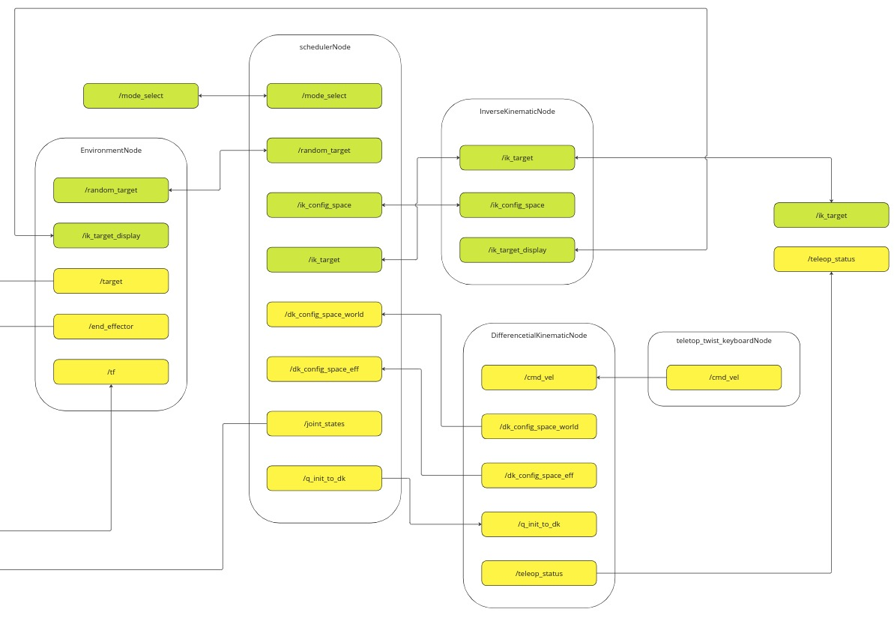
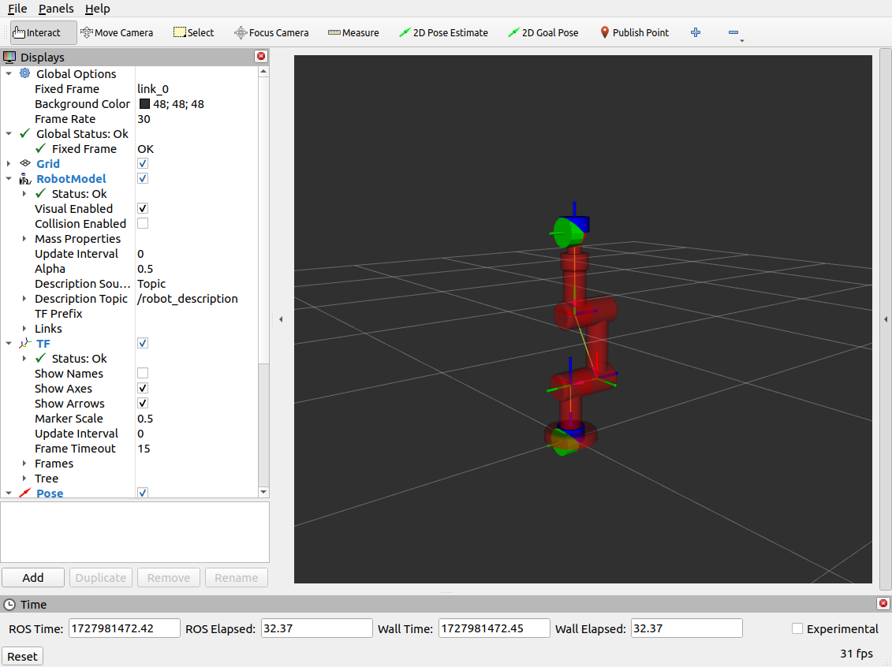
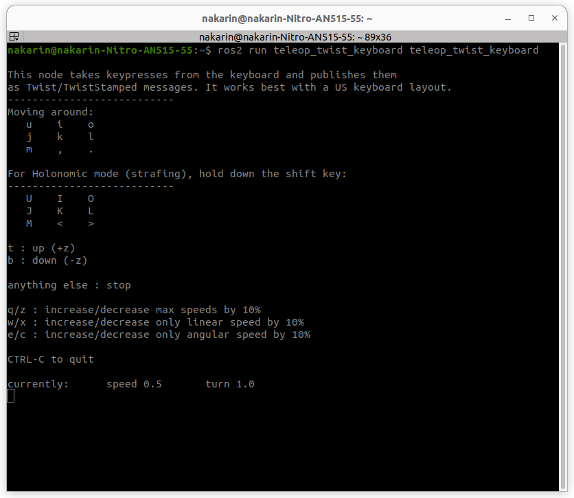
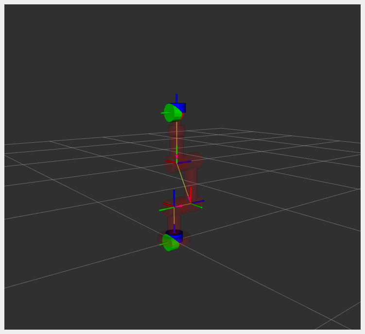
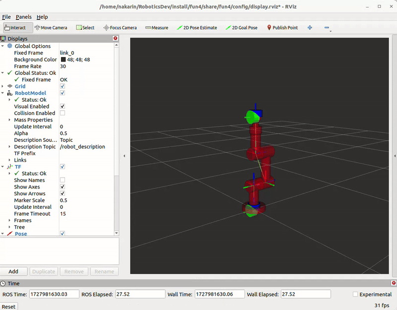
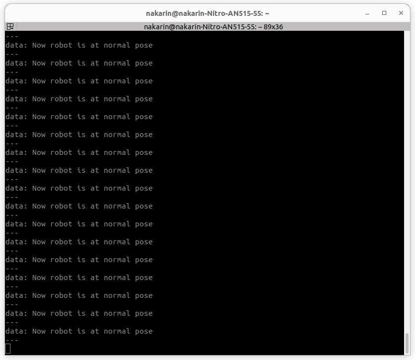
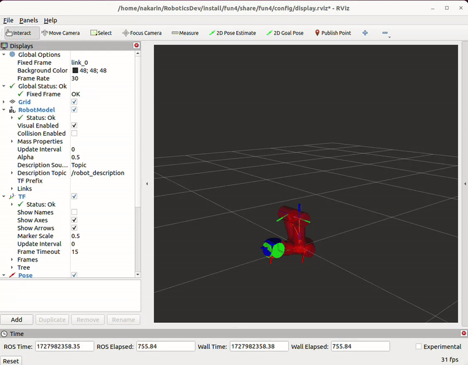

<a id="readme-top"></a>

# FUN4
**This is fun4 assignment in FRA501(Robotics Development) class at **FIBO**. With content about manipulator control system for 3 DOF robot arm.**


<p align="center"></p>

<!-- TABLE OF CONTENTS -->
<details>
  <summary>Table of Contents</summary>
  <ol>
    <li>
      <a href="#about-the-project">About The Project</a>
        <ul>
            <li><a href="#system-architecture">System architecture</a></li>
        </ul>
    </li>
    <li>
      <a href="#getting-started">Getting Started</a>
      <ul>
        <li><a href="#prerequisites">Prerequisites</a></li>
            <ul>
                <li><a href="#python-packages">Python packages</a></li>
                <li><a href="#ros2-packages">ROS2 packages</a></li>
            </ul>
        <li><a href="#installation">Installation</a></li>
      </ul>
    </li>
    <li><a href="#usage">Usage</a></li>
    <ul>
        <li><a href="#launch-the-project">Launch the project</a></li>
        <li><a href="#service-call-in-this-project">Service call in this project</a></li>
        <li><a href="#teleop_twist_keyboard">Teleop twist keyboard</a></li>
    </ul>
    <li><a href="#features">Features</a></li>
    <li><a href="#contact">Contact</a></li>
  </ol>
</details>

<!-- ABOUT THE PROJECT -->
## About The Project

This project is in FRA501(Robotics Development) class at **FIBO** that teach about ROS2 humble. So **FUN4** is the one of this class assignment that have the mission to control manipulator RRR robot arm.

### System architecture

*   **Full system architecture**
    <p align="center"></p>
    This architecture show how all of nodes in this project communicate with each other.

*   **Robot system architecture**
    <p align="center"></p>

    If we focus only robot system architecture. The main component that control all of activity of robot is 1st node "`Scheduler node`". This node is the main component of this project that has role to **select mode**, **control input/output data between nodes**, **publish joint states** and ETC. 2nd is `Environment node` that has role to **Calculate the workspace for random target**, **random target for auto mode**, **publish end-effector & target pose**. 3rd node is `Inverse kinematic node`. This node has role to calculate the **Inverse kinematic to find joint position target of request taskspace** and last node is `Differencetial kinematic node` that has role to **calculate the velocity of joint from endeffector velocity**. There are also other node work with this project, you can see on Full system architecture.

<!-- GETTING STARTED -->
## Getting Started

### Prerequisites

To use this project. You need to have all of prerequisites for this project.

#### Python packages

⚠️  **Warning:**    Make sure you have python version >= 3.6 already.

*   setuptool

    ```
    pip3 install setuptools==59.6.0
    ```

*   numpy

    ```
    pip3 install numpy==1.24.1
    ```

*   scipy

    ```
    pip3 install scipy==1.8.0
    ```

*   matplotlib

    ```
    pip3 install matplotlib==3.5.1
    ```

*   robotics toolbox

    ```
    pip3 install roboticstoolbox-python
    ```

#### ROS2 packages

⚠️  **Warning:**     Make sure you have ROS2 humble already.

*   teleop_twist_keyboard

    ```
    sudo apt-get install ros-humble-teleop-twist-keyboard
    ```

### Installation

Follow the command below to dowload and install package.
1.  Go to home directory

    ```
    cd
    ```

2.  Clone the repository

    ```
    git clone https://github.com/nakerin7588/RoboticsDev.git --branch=fun4
    cd RoboticsDev
    ```

3.  Build & Source the packages

    ```
    colcon build
    source install/setup.bash
    ```

<p align="right">(<a href="#readme-top">back to top</a>)</p>

<!-- USAGE -->
## Usage

⚠️  **Warning:**    Before use this project you need to `source ~/RoboticsDev/install/setup.bash` and `source /opt/ros/humble/setup.bash` everytime that you open new terminal. If you want to make sure that 2 path has been source everytime when open new terminal you can follow the command below and next time you open new terminal .bashrc will source everything you write on that file.

```
echo "source ~/RoboticsDev/install/setup.bash" >> ~/.bashrc
echo "source /opt/ros/humble/setup.bash" >> ~/.bashrc
source ~/.bashrc
```

### Launch the project

```
ros2 launch fun4 robot_bringup.launch.py
```

After launch the project rviz2 window will show on your screen with red RRR robot arm like this picture below.

<p align="center"></p>

### Service call in this project

1. **Mode select**

    ```
    ros2 service call /mode_select fun4_interfaces/srv/SetModePosition "mode: <mode>"
    ```

    Change `<mode>` to mode that you want to use such as :

    *  `0` for `wait` mode
    *  `1` for `inverse kinematic` mode
    *  `2` for `teleop/reference velocity from end-effector frame` mode
    *  `3` for `teleop/reference velocity from world frame` mode
    *  `4` for `auto` mode

<p align="right">How to use mode will explain in the next section.</p>

2. **Inverse kinematic mode target**

    ```
    ros2 service call /ik_target fun4_interfaces/srv/SetModePosition "position: {x: <x_pos>, y: <y_pos>, z: <z_pos>}"
    ```

    Change `<x_pos>`, `<x_pos>`, `<x_pos>` to position of axis that you want.

### Teleop_twist_keyboard

```
ros2 run teleop_twist_keyboard teleop_twist_keyboard
```

After run that command you will have teleop keyboard on your terminal that can control robot in teleoperation mode.

 <p align="center"></p>

This keyboard has main 7 keys to control the robot.
*   `k` : for stop motion.
*   `I (left shift + i)` : for apply linear velocity on X-axis (+x)
*   `< (left shift + ,)` : for apply linear velocity on X-axis (-x)
*   `J (left shift + ,)` : for apply linear velocity on Y-axis (+y)
*   `L (left shift + ,)` : for apply linear velocity on Y-axis (-y)
*   `t` : for apply linear velocity on Z-axis (+z)
*   `b` : for apply linear velocity on Z-axis (-z)

Optional key are `q/z` : for increase/decrease max speeds by 10%

<p align="right">(<a href="#readme-top">back to top</a>)</p>

## Features

1.  **Show workspace of the robot**

    To show workspace of the robot you must execute the `workspace.ipynb` in VScode. You can follow by this command below.

    ```
    code ~/RoboticDev/notebook/workspace.ipynb
    ```

    After that you can see the workspace in VScode like this picture below.

     <p align="center"></p>

     But in the Environment node this project define workspace in `random function` this function will random the number in range of link lenght and recheck it to make sure that number is in workspace.

     ```Python
    def random_func(self, l1 = 0.2, l2 = 0.25, l3 = 0.28):
    '''
    Random function
    This funtion is random the target that is taskspace of manipulator with manipulator lenght to define work space of it.
    '''
    while(True):
        x = random.uniform(-(l2+l3), (l2+l3))
        y = random.uniform(-(l2+l3), (l2+l3))
        z = random.uniform(-(l2+l3), (l1+l2+l3))
        if np.sqrt(x**2 + (z-l1)**2) < l2+l3 and np.sqrt(y**2 + (z-l1)**2) < l2+l3:
            return x, y, z
     ```

2.  **Show End-effector and Target pose**

    This feature can show the current end-effector pose and target pose(From inverse kinematic and auto mode). After you launch the project you can see the axis ball on end-effector of robot and robot base like the picture below that is an initial end-effector pose and target pose.
    <p align="center"></p>

    All of those pose is come from this function.

    ```Python
    def target_publish_func(self, position):
        try:
            msg = PoseStamped()
            msg.header.frame_id = "link_0"
            msg.header.stamp = self.get_clock().now().to_msg()
            msg.pose.position.x = position[0]
            msg.pose.position.y = position[1]
            msg.pose.position.z = position[2]
            self.target_pub.publish(msg)
        except Exception as e:
            self.get_logger().error(f"Target_publish_function has {e}")
            
    def eff_publish_func(self, tf):
        try:
            if tf == None:
                raise ValueError("Wait for tf.")
            msg = PoseStamped()
            msg.header.frame_id = "link_0"
            msg.header.stamp = self.get_clock().now().to_msg()
            msg.pose.position.x = tf.translation.x
            msg.pose.position.y = tf.translation.y
            msg.pose.position.z = tf.translation.z
            msg.pose.orientation.w = tf.rotation.w
            msg.pose.orientation.x = tf.rotation.x
            msg.pose.orientation.y = tf.rotation.y
            msg.pose.orientation.z = tf.rotation.z
            self.end_effector_pub.publish(msg)
        except ValueError as e:
            self.get_logger().error(f"Eff publish function has {e}")
    ```

3.  **Wait mode**

    This mode work like idle mode to wait for the command when you launch the project robot will entry to this mode first.

    ⚠️  **Warning:** Make sure you launch this project first.<b align="right">(<a href="#launch-the-project">How to launch this project</a>)</b>

    To change the mode when you are in other mode. You can follow this command below.

    ```
    ros2 service call /mode_select fun4_interfaces/srv/SetModePosition "mode: 0"
    ```

    After that robot will stop at current position until you change mode to move the robot.

4.  **Inverse kinematic mode**

    This mode has ability to move the robot end-effector to the target position you want by calculate inverse kinematic.

    ⚠️  **Warning:** Make sure you launch this project first.<b align="right">(<a href="#launch-the-project">How to launch this project</a>)</b>

    To use this mode you can follow by this command below.

    ```
    ros2 service call /mode_select fun4_interfaces/srv/SetModePosition "mode: 1"
    ```

    After that you can set the target of the robot by this commad below. In this example will define the target as x: 0.01, y: 0.2, z: 0.04

    ```
    ros2 service call /ik_target fun4_interfaces/srv/SetModePosition "position: {x: 0.01, y: 0.2, z: 0.04}"
    ```

    After run this command the robot on rviz will move to the target and end-effector/target ball will show together.

    ⚠️  **Warning:** If the last target is not reach(robot is in other mode when it not reach the target) and you change mode to inverse kinematic mode robot will move to that target first.

    <p align="center"></p>

    <p align="center"></p>

    Invert kinematic is solve by this function.

    ```Python
    def computeRRRIK(self, request, response):
        '''
        Compute RRR inverse kinematic function.
        This function is calculate joint position from taskspace and compute it via robotics toolbox inverse kinematic.
        And also send the target joint position to scheduler node for calculate trajectory and publish current joint position to rviz.
        '''
        try:
            x2 = request.position.x ** 2
            z_shifted = request.position.z - self.l1
            z2 = z_shifted ** 2
            r = math.sqrt(x2 + z2) 
            
            if r > (self.l2 + self.l3):
                self.get_logger().info(f'r = {r}')
                raise ValueError("Target is out of reach for the manipulator.")
            
            target = SE3(request.position.x, request.position.y, request.position.z)
            
            self.ik_config_space_var = self.robot.ikine_LM(Tep=target, mask=[1, 1, 1, 0, 0, 0]).q
            
            for i in range(3):
                self.ik_config_space_var[i] = self.normalize_angle(self.ik_config_space_var[i])
            
            self.send_joint_state()
            
            request_ik_target_display = SetModePosition.Request()
            request_ik_target_display.position.x = request.position.x
            request_ik_target_display.position.y = request.position.y
            request_ik_target_display.position.z = request.position.z
            self.ik_target_client.call_async(request=request_ik_target_display)
            
            response.success = True
            response.message = f'The configuration space from IK are q1: {self.ik_config_space_var[0]}, q2: {self.ik_config_space_var[1]}, q3: {self.ik_config_space_var[2]}'
            return response
            
        except ValueError as e:
            self.get_logger().error(f"Compute RRR inverse kinematic has {e}")
            response.success = False
            response.message = "Cann't calculate the IK."
            return response 
    ```

5.  **Teleoperation mode**

    This mode has ability to move the robot by using `teleop_twist_keyboard` that can set the velocity and send it to the robot. This mode has 2 sub-modes:

    ⚠️  **Warning:** Make sure you launch this project & run teleop_twist_keyboard first.<b align="right">(<a href="#launch-the-project">How to launch this project</a>)</b><b align="right">(<a href="#teleop_twist_keyboard">How to run teleop_twist_keyboard</a>)</b>


    *   Velocity that reference from end-effector frame<br>
        To use this mode you can follow by this command below.

        ```
        ros2 service call /mode_select fun4_interfaces/srv/SetModePosition "mode: 2"
        ```

        In this mode will know that velocity you send to robot will reference from end-effector frame like if you send velocity on X-axis robot will move through the X-axis of end-effector frame like GIF below.

         <p align="center"></p>

    *   Velocity that reference from world frame<br>
        To use this mode you can follow by this command below.

        ```
        ros2 service call /mode_select fun4_interfaces/srv/SetModePosition "mode: 2"
        ```
        
    This feature is solve by Differencetial kinematic $\dot{q} = J^{-1}(q) \dot{p}$ and send joint velocity to calculate to joint position in realtime later.You can see the function below.

    ```Python
    def compute_q_dot(self, joint_angles, ee_velocity, threshold=0.001):
        '''
        Compute joint velocity function
        This function is calculate the joint velocity from this formula below:
                            q_dot = inv_jacobian(q) * v
            Let: 
                q_dot is joint velocity
                inv_jacobian is inverse of jacobian matrix from current q position (In this program use psedo_inverse form numpy)
                v is velocity that reference from world frame
        And also calculate the det of jacobian matrix to check is that pose of manipulator has singularity from this formula below:
                    w = det(J(q)); if w is near to 0, means that manipulator has singularity
        '''
        try:
            J = self.robot.jacob0(joint_angles)
            J = J[:3, :3]
            J_pseudo_inv = np.linalg.pinv(J)
            joint_velocities = J_pseudo_inv @ ee_velocity
            J_ = self.robot.jacob0(np.array(joint_angles)+(joint_velocities / self.rate))
            J_ = J_[:3, :3]
            w = np.linalg.det(J_)
            if (-threshold) <= w <= threshold:
                msg = String()
                msg.data = "Now robot is at singularity pose"
                self.teleop_status_pub.publish(msg)
                return np.array([0.0, 0.0, 0.0])
            msg = String()
            msg.data = "Now robot is at normal pose"
            self.teleop_status_pub.publish(msg)
            return joint_velocities
        except Exception as e:
            self.get_logger().error(f"Compute q dot function has {e}")
    ```

    Of two sub-modes there are some difference between each other that is input of the function.
    *   1st mode is

        ```Python
        self.joint_velocity = self.compute_q_dot(self.current_joint_angles, self.linear_velo @ self.robot.fkine(self.current_joint_angles).R)
        ```
    
    *   2nd mode is

        ```Python
        self.joint_velocity = self.compute_q_dot(self.current_joint_angles, self.linear_velo)
        ```

    **At 1st mode there is Rotation matrix to multiply to linear velocity first for map to end-effector frame.**

    If you want to see `teleop status` you can follow by this command below for see the teleop_status topic like terminal 2 at teleoperation sub-modes pictures(both).

    ```
    ros2 topic echo /teleop_status
    ```

    <p align="center"></p>

6.  **Auto mode**

    This mode is like Inverse kinematic mode that will move the robot end-effector to the target position but this mode will random the target from environment mode and then will send the target to inverse kinematic mode to calculate. **You can see the architecture diagram on the top of this README** <b align="right">(<a href="#system-architecture">System architecture</a>)</b>
    
    ⚠️  **Warning:** Make sure you launch this project first.<b align="right">(<a href="#launch-the-project">How to launch this project</a>)</b>

    To use this mode you can follow by this command below.

    ```
    ros2 service call /mode_select fun4_interfaces/srv/SetModePosition "mode: 4"
    ```

    After that robot will automatically random the target and move the robot to that target until the robot reach target. Target will random new position.

    <p align="center"></p>

    <p align="center"></p>

<p align="right">(<a href="#readme-top">back to top</a>)</p>

<!-- CONTACT -->
## Contact

Nakarin Jettanatummajit - nakerin7588@gmail.com - nakarin.jett@mail.kmutt.ac.th

Project Link: [https://github.com/nakerin7588/RoboticsDev/tree/fun4](https://github.com/nakerin7588/RoboticsDev/tree/fun4)

<p align="right">(<a href="#readme-top">back to top</a>)</p>
