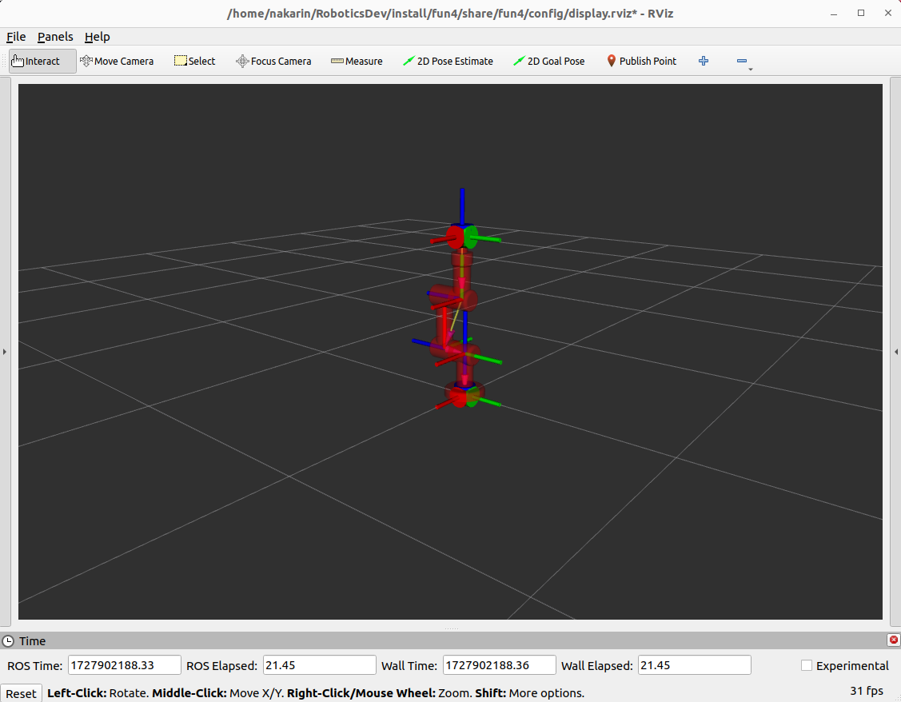

<a id="readme-top"></a>

# FUN4
**This is fun4 assignment in FRA501(Robotics Development) class at **FIBO**. With content about manipulator control system for 3 DOF robot arm.**




<!-- TABLE OF CONTENTS -->
<details>
  <summary>Table of Contents</summary>
  <ol>
    <li>
      <a href="#about-the-project">About The Project</a>
    </li>
    <li>
      <a href="#getting-started">Getting Started</a>
      <ul>
        <li><a href="#prerequisites">Prerequisites</a></li>
            <ul>
                <li><a href="#python-packages">Python packages</a></li>
                <li><a href="#ros2-packages">ROS2 packages</a></li>
            </ul>
        <li><a href="#installation">Installation</a></li>
      </ul>
    </li>
    <li><a href="#usage">Usage</a></li>
    <ul>
        <li><a href="#launch-the-project">Launch the project</a></li>
        <li><a href="#service-call-in-this-project">Service call in this project</a></li>
        <li><a href="#mode">Mode</a></li>
    </ul>
    <li><a href="#contact">Contact</a></li>
    <li><a href="#acknowledgments">Acknowledgments</a></li>
  </ol>
</details>

<!-- ABOUT THE PROJECT -->
## About The Project


<!-- GETTING STARTED -->
## Getting Started
### Prerequisites
To use this project. You need to have all of prerequisites for this project.
#### Python packages
⚠️  **Warning:**    Make sure you have python version >= 3.6 already.
*   setuptool
    ```
    pip3 install setuptools==59.6.0
    ```
*   numpy
    ```
    pip3 install numpy==1.24.1
    ```
*   scipy
    ```
    pip3 install scipy==1.8.0
    ```
*   matplotlib
    ```
    pip3 install matplotlib==3.5.1
    ```
*   robotics toolbox
    ```
    pip3 install roboticstoolbox-python
    ```
#### ROS2 packages
⚠️  **Warning:**     Make sure you have ROS2 humble already.
*   teleop_twist_keyboard
    ```
    sudo apt-get install ros-humble-teleop-twist-keyboard
    ```

### Installation
Follow the command below to dowload and install package.
1.  Go to home directory
    ```
    cd
    ```
2.  Clone the repository
    ```
    git clone https://github.com/nakerin7588/RoboticsDev.git --branch=fun4 & cd RoboticsDev
    ```
3.  Build & Source the packages
    ```
    colcon build & source install/setup.bash
    ```

<p align="right">(<a href="#readme-top">back to top</a>)</p>

<!-- USAGE -->
## Usage
⚠️  **Warning:**    Before use this project you need to `source ~/RoboticsDev/install/setup.bash` every time that you open new terminal.
### Launch the project
```
ros2 launch fun4 robot_bringup.launch.py
```
After launch the project rviz2 window will show on your screen with red RRR robot arm like this picture below.

### Service call in this project
1. Mode select
    ```
    ros2 service call /mode_select fun4_interfaces/srv/SetModePosition "mode: <mode>"
    ```
    Change `<mode>` to mode that you want to use such as :
    1.  `0` for `wait` mode
    2.  `1` for `inverse kinematic` mode
    3.  `2` for `teleop/reference velocity from end-effector frame` mode
    4.  `3` for `teleop/reference velocity from world frame` mode
    5.  `4` for `auto` mode
<p align="right">How to use mode will explain in the next section.</p>

2. Inverse kinematic mode target
    ```
    ros2 service call /ik_target fun4_interfaces/srv/SetModePosition "position: {x: <x_pos>, y: <y_pos>, z: <z_pos>}"
    ```
    Change `<x_pos>`, `<x_pos>`, `<x_pos>` to position of axis that you want.

### Mode
This section explains how to use all the modes this project has.

<p align="right">(<a href="#readme-top">back to top</a>)</p>

<!-- CONTACT -->
## Contact

<p align="right">(<a href="#readme-top">back to top</a>)</p>

<!-- ACKNOWLEDGMENTS -->
## Acknowledgments

<p align="right">(<a href="#readme-top">back to top</a>)</p>