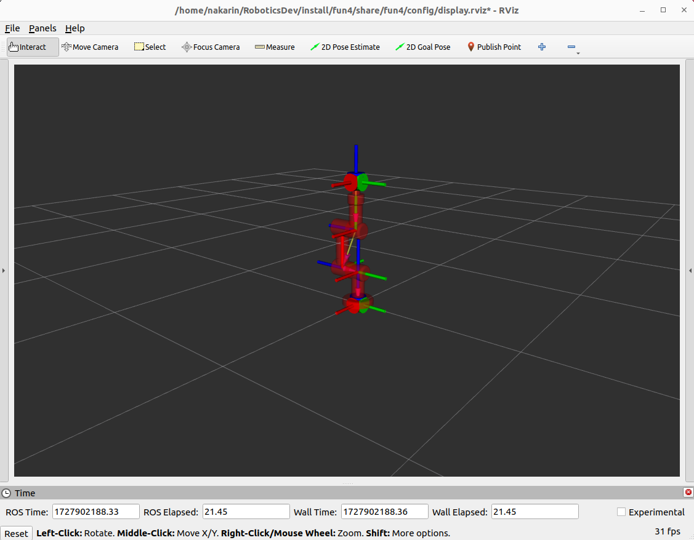

# FUN4
This is fun4 assignment in FRA501 class at **FIBO**. With content about manipulator control system for 3 DOF robot arm.

<!-- GETTING STARTED -->
## Getting Started
### Prerequisites
To use this project. You need to have all of prerequisites for this project.
### Installation
### Usage
### Contact
### Acknowledgments